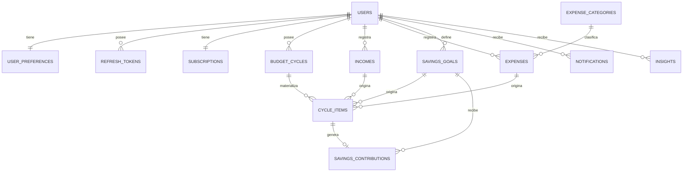

# LUMA — FASE 0: Análisis y Arquitectura

**Versión:** 1.0
**Fecha:** 13 de septiembre de 2026
**Estado:** Propuesta para aprobación — **no se ha escrito código todavía**

---

## 0. Cómo leer este documento

Este entregable cubre los 10 puntos de la *Instrucción Inicial* del prompt maestro. A partir de la Fase 1 adoptaré el formato de respuesta de la sección §23 (Objetivo → Impacto → Archivos → Decisiones → Riesgos → Implementación → Validación).

El documento está ordenado por utilidad de decisión, no por el orden del prompt:

1. Hallazgos críticos (lo que cambia el diseño)
2. Arquitectura propuesta
3. Estructura del monorepo
4. Modelo de datos y relaciones
5. APIs principales
6. Versiones y librerías concretas
7. Tecnologías adicionales necesarias
8. Mejoras recomendadas
9. Riesgos técnicos
10. Suposiciones
11. Preguntas abiertas (bloqueantes / no bloqueantes)
12. Plan de fases ajustado

**Lo más importante está en las secciones 1 y 11.** Si solo vas a leer dos secciones, que sean esas.

---

## 1. Hallazgos críticos: inconsistencias y decisiones pendientes

El prompt maestro es sólido y está mucho mejor especificado que un brief típico. Encontré **nueve puntos** que hay que resolver antes de escribir la primera migración de base de datos, porque afectan al esquema y al motor presupuestal — las dos cosas más caras de cambiar después.

Los ordeno por impacto.

---

### 1.1 🔴 CRÍTICO — El modelo no distingue *plan* de *ejecución real*

**El problema.** El modelo de dominio propuesto (`Income`, `FixedExpense`, `VariableExpense`, `SavingsGoal`) describe únicamente el **presupuesto planificado**. No existe ninguna entidad que registre **lo que realmente ocurrió**: si el pago se hizo, cuándo, y por cuánto.

Pero la misión del producto exige exactamente eso:

| Pregunta que LUMA debe responder | ¿Se puede con el modelo actual? |
|---|---|
| ¿Qué pagos tengo próximos? | Parcialmente (calculable desde `dueDate`) |
| ¿Tengo pagos vencidos? | ❌ No — no hay estado "pagado" |
| ¿Estoy gastando más de lo que gano? | ❌ No — solo hay montos planificados |
| "Tus gastos variables subieron 20% en 3 ciclos" (ejemplo textual del prompt, §LUMA-AI) | ❌ No — no hay historial de ejecución |
| ¿Cuánto llevo ahorrado realmente? | Sí, vía `SavingsContribution` |

Nota que `SavingsContribution` **sí** modela ejecución real (aportaciones con fecha), pero los gastos no tienen su equivalente. Es una asimetría en el diseño.

**Consecuencia si no se resuelve:** el módulo LUMA-AI (§LUMA-AI) queda sin datos que analizar. Las "tendencias", "detección de incrementos" y "proyecciones" serían imposibles o se basarían únicamente en cambios del plan, que no es lo mismo que comportamiento financiero.

**Propuesta.** Introducir una entidad de materialización por ciclo: `cycle_items`.

Cuando se abre un `BudgetCycle`, el sistema genera un **snapshot** de todos los ingresos, gastos fijos, gastos variables y aportaciones de ahorro que aplican a ese ciclo. Cada fila es un `CycleItem` con:

```
plannedAmount   ← lo que se presupuestó
actualAmount    ← lo que realmente ocurrió (null hasta confirmar)
status          ← PENDING | PAID | PARTIAL | SKIPPED | OVERDUE
dueDate         ← fecha límite dentro de este ciclo
settledAt       ← cuándo se marcó como pagado
```

Esto resuelve de un solo golpe:

- **Próximos pagos** y **pagos vencidos** del dashboard (§LUMA-DASHBOARD) → query directa sobre `status` y `dueDate`
- **Historial real** para la IA
- **Inmutabilidad histórica**: si el usuario sube la renta hoy, los ciclos pasados no se reescriben (ver 1.2)
- **Unifica** el tratamiento de fijos y variables (ver 1.3)
- Da a la UI un objeto natural sobre el que construir listas dinámicas, filtros, estados y confirmaciones — justamente lo que pide §4 para practicar automatización

**Costo:** una tabla más y un servicio de materialización de ciclo. Es la inversión de arquitectura con mayor retorno de todo el proyecto.

---

### 1.2 🔴 CRÍTICO — Sin snapshot, la historia financiera es mutable

Consecuencia directa de 1.1, pero merece su propio punto porque es un error clásico y grave en apps financieras.

Si el dashboard de "octubre" calcula en vivo leyendo `fixed_expenses.amount`, entonces cuando en diciembre suba la renta de \$8,000 a \$9,000, **octubre pasará a mostrar \$9,000 retroactivamente**. El usuario verá cifras históricas que cambian solas. Es el tipo de bug que destruye la confianza en una app de dinero y es casi imposible de depurar después.

**Regla de diseño propuesta:** *un ciclo cerrado es inmutable*. Los datos históricos se leen de `cycle_items`, nunca de las entidades maestras. Las entidades maestras (`fixed_expenses`, etc.) son **plantillas** que alimentan la creación de ciclos futuros.

Ciclo de vida propuesto:

```
DRAFT ──► ACTIVE ──► CLOSED
  │          │
  │          └─► el usuario opera aquí (confirma pagos, ajusta montos)
  └─► generado por el sistema, el usuario revisa gastos variables (§LUMA-VARIABLE-EXPENSES)
```

---

### 1.3 🟠 ALTO — Asimetría entre gastos fijos y variables

El prompt define `VariableExpenseCycle` (§8) pero **no** un `FixedExpenseCycle` equivalente. Sin embargo los gastos fijos también cambian: la luz varía cada bimestre, la gasolina cada quincena, y un gasto fijo puede pagarse tarde.

Adicionalmente, el catálogo de sugerencias de §LUMA-ONBOARDING lista **"Comida"** como gasto fijo, cuando en la práctica es el gasto más variable de casi cualquier presupuesto. Esto sugiere que la frontera fijo/variable es más difusa de lo que el modelo asume.

**Propuesta.** La entidad `cycle_items` de 1.1 sustituye a `VariableExpenseCycle` y aplica uniformemente a ambos tipos. La distinción fijo/variable se conserva como **clasificación del gasto** (`expense_kind`), no como dos mecanismos distintos de cálculo.

Diferencia funcional que sí se mantiene:

| | Gasto fijo | Gasto variable |
|---|---|---|
| Monto al abrir ciclo | Se copia automáticamente | Requiere **revisión del usuario** |
| Estado inicial del item | `PENDING` | `NEEDS_REVIEW` |
| Flujo §LUMA-VARIABLE-EXPENSES | — | Actualizar / confirmar / quitar del ciclo / desactivar |

---

### 1.4 🟠 ALTO — El ahorro aparece en la fórmula pero no existe en el modelo

La fórmula del motor presupuestal (§LUMA-BUDGET-ENGINE) es:

```
Ingresos − Gastos Fijos − Gastos Variables − Ahorros = Balance
```

El término "Ahorros" trata el ahorro como una **salida planificada por ciclo**. Pero `SavingsGoal` (§8) solo tiene `targetAmount`, `currentAmount` y `targetDate`. **No hay ningún campo que diga cuánto se planea aportar en este ciclo.** El motor literalmente no tiene qué restar.

**Propuesta.** Añadir un plan de aportación a la meta:

```
savings_goals
  ...
  contribution_mode      AUTO_BY_TARGET_DATE | FIXED_PER_CYCLE | MANUAL
  planned_per_cycle      DECIMAL(15,2)   -- usado si FIXED_PER_CYCLE
  priority               INT             -- para repartir excedente y para recortes sugeridos
```

Con `AUTO_BY_TARGET_DATE` el sistema deriva el aporte: `(targetAmount − currentAmount) / ciclos_restantes_hasta_targetDate`. Esto además responde directamente a la pregunta de misión *"¿Cuánto necesito ahorrar para alcanzar una meta?"*.

El campo `priority` habilita después la lógica de déficit de §LUMA-AI ("reducir temporalmente el ahorro") sin adivinar qué meta sacrificar.

---

### 1.5 🟠 ALTO — Ciclo presupuestal vs. frecuencia de ingresos/gastos: la decisión de negocio #1

Esta es la ambigüedad de negocio más importante del documento y **necesito tu decisión** antes de diseñar el motor.

`BudgetCycle` puede ser QUINCENAL, MONTHLY o BIMONTHLY. Los ingresos y gastos tienen su propia `frequency`. Cuando no coinciden, hay que decidir:

**Caso concreto.** Usuario con ciclo **quincenal**, renta de \$8,000 que vence el día 1 de cada mes.

| Opción | Quincena 1 (1–15) | Quincena 2 (16–31) | Comentario |
|---|---|---|---|
| **A — Prorrateo** | \$4,000 | \$4,000 | Balance "suave", pero no refleja el flujo de caja real. La quincena 1 parece tener dinero que en realidad ya se fue. |
| **B — Por fecha de vencimiento** | \$8,000 | \$0 | Refleja la realidad de caja. La quincena 1 puede salir en déficit aunque el mes completo esté balanceado. |
| **C — Asignación manual** | usuario decide | usuario decide | Máxima fidelidad, máxima fricción en el onboarding. |

**Mi recomendación: B como default, con override manual por gasto (C como escape).** Razones:

- Es cómo la gente razona realmente: *"esta quincena me toca pagar la renta"*
- El prompt pide explícitamente detectar déficit; el prorrateo **esconde** déficits de caja reales
- El override manual permite al usuario que sí prorratea (aparta la mitad en la quincena 1) modelarlo

Implicación de diseño: si eliges B, el dashboard debe mostrar **dos horizontes** — el ciclo actual y el período natural (mes) — porque si no, la quincena 1 se ve alarmante sin contexto. Lo propongo como `BudgetSummary` con `cycleView` y `monthView`.

Preguntas relacionadas que se derivan:

- ¿Un usuario tiene **un solo** tipo de ciclo activo, o pueden coexistir (p. ej. presupuesta mensual pero cobra quincenal)? → **Recomiendo uno solo en v1.** Permitir varios multiplica la complejidad del motor sin beneficio claro para el MVP.
- ¿Puede cambiar de tipo de ciclo después del onboarding? → **Recomiendo sí, pero solo a partir del siguiente ciclo**, nunca reescribiendo el actual ni el historial.

---

### 1.6 🟡 MEDIO — `Subscription` mezcla dos conceptos distintos

§LUMA-SUBSCRIPTIONS lista `FREE | PREMIUM` y luego `ACTIVE | EXPIRED | CANCELED | PENDING` como si fueran el mismo campo. Son dos dimensiones ortogonales:

```
plan    : FREE | PREMIUM          ← qué compró
status  : ACTIVE | PENDING | EXPIRED | CANCELED | GRACE_PERIOD   ← en qué estado está
```

Un usuario puede estar en `PREMIUM / CANCELED` y conservar acceso hasta el fin del período pagado. Separarlos desde el inicio evita una migración dolorosa cuando entre el billing real.

**Pregunta abierta asociada:** *¿qué limita concretamente el plan FREE?* El prompt dice que PREMIUM incluye la IA, pero no si FREE tiene límite de metas de ahorro, de gastos, de historial de ciclos, etc. Sin esa definición no puedo diseñar el `FeatureAccessService`. Ver §11.

---

### 1.7 🟡 MEDIO — Almacenamiento de tokens: web y móvil tiran en direcciones opuestas

§7 pide JWT + refresh token, y §6 pide preparar para móvil. Hay una tensión real aquí:

| Estrategia | Seguridad web | Compatibilidad móvil |
|---|---|---|
| Access + refresh en `localStorage` | ❌ Vulnerable a XSS — un script inyectado roba la sesión completa | ✅ Trivial |
| Refresh en **cookie HttpOnly + SameSite**, access en **memoria** | ✅ Recomendado por OWASP | ⚠️ Requiere manejo especial en móvil |

**Mi recomendación:** diseñar el endpoint `/auth/login` para que **devuelva el refresh token en cookie HttpOnly cuando el cliente es web** y **en el body cuando el cliente es móvil**, distinguido por un header `X-Client-Type` o por rutas separadas. El access token vive en memoria en ambos casos (Zustand no persistido).

Esto añade ~un día de trabajo en Fase 2 y evita tener que rehacer autenticación cuando llegue la app móvil. Necesito tu confirmación porque implica configurar CORS con credenciales y un endpoint de rotación de refresh token.

---

### 1.8 🟡 MEDIO — Formato de error: el propuesto vs. el estándar

El formato de §13 es correcto y usable. Dos observaciones:

1. **Falta `traceId`.** §15 pide correlation IDs; el error que ve el usuario debe poder correlacionarse con el log. Es gratis añadirlo ahora.
2. **Spring Boot soporta RFC 9457 (Problem Details) de forma nativa** vía `ProblemDetail`. Adoptarlo da interoperabilidad estándar sin escribir un `@ControllerAdvice` desde cero.

Propongo el híbrido: `ProblemDetail` de Spring como base + las extensiones que ya definiste.

```json
{
  "type": "https://luma.app/errors/validation",
  "title": "Validation failed",
  "status": 400,
  "detail": "El monto debe ser mayor que cero",
  "instance": "/api/v1/incomes",
  "timestamp": "2026-09-13T10:00:00Z",
  "errorCode": "VALIDATION_ERROR",
  "traceId": "8f3c1a2b-...",
  "errors": [
    { "field": "amount", "message": "Amount must be greater than zero" }
  ]
}
```

Si prefieres el formato exacto de §13 sin `type`/`title`, también funciona — dímelo y lo respeto tal cual.

---

### 1.9 🟢 BAJO — Conflicto menor en la documentación

§DOCUMENTACIÓN API dice *"No crear documentación manual duplicada"*, pero §16 pide `docs/api.md`. Lo resuelvo así: `docs/api.md` documenta **convenciones transversales** (autenticación, paginación, formato de errores, versionado, idempotencia). El catálogo endpoint-por-endpoint vive solo en OpenAPI/Swagger, generado desde el código.

---

### Resumen de hallazgos

| # | Hallazgo | Severidad | ¿Bloquea Fase 1? |
|---|---|---|---|
| 1.1 | Falta modelo de ejecución real | 🔴 | Sí |
| 1.2 | Historia financiera mutable sin snapshot | 🔴 | Sí |
| 1.3 | Asimetría fijos/variables | 🟠 | Sí |
| 1.4 | Ahorro no modelado como salida por ciclo | 🟠 | Sí |
| 1.5 | Ciclo vs. frecuencia (prorrateo o fecha) | 🟠 | Sí |
| 1.6 | `Subscription` mezcla plan y status | 🟡 | No (Fase 12) |
| 1.7 | Almacenamiento de tokens | 🟡 | No (Fase 2) |
| 1.8 | Formato de error | 🟡 | No |
| 1.9 | Docs duplicadas | 🟢 | No |

---

## 2. Arquitectura propuesta

### 2.1 Vista general

```
┌─────────────────────────────────────────────────────────────┐
│                      CLIENTES                               │
│                                                             │
│   React SPA (v1)      │  iOS / Android (futuro)  │  PWA      │
│   TypeScript + MUI    │                          │  (futuro) │
└───────────┬─────────────────────┬──────────────────┬─────────┘
            │                     │                  │
            └─────────────────────┴──────────────────┘
                                 │
                        HTTPS · REST · JWT
                                 │
            ┌────────────────────▼────────────────────┐
            │        SPRING BOOT — MODULAR MONOLITH   │
            │                                         │
            │  ┌───────────────────────────────────┐  │
            │  │  api        (REST controllers)    │  │
            │  ├───────────────────────────────────┤  │
            │  │  application (casos de uso)       │  │
            │  ├───────────────────────────────────┤  │
            │  │  domain     (modelo + reglas)     │  │
            │  ├───────────────────────────────────┤  │
            │  │  infrastructure (JPA, clientes)   │  │
            │  └───────────────────────────────────┘  │
            │                                         │
            │  Módulos: auth · users · budget ·       │
            │  income · expenses · savings ·          │
            │  dashboard · notifications ·            │
            │  subscriptions · insights               │
            └────────────────────┬────────────────────┘
                                 │
                    ┌────────────┴────────────┐
                    │                         │
            ┌───────▼────────┐      ┌─────────▼─────────┐
            │  MySQL 8.4 LTS │      │  Proveedor Email  │
            │                │      │  (Fase 2)         │
            └────────────────┘      └───────────────────┘
                                    ┌───────────────────┐
                                    │  Proveedor IA     │
                                    │  (Fase 13+)       │
                                    └───────────────────┘
```

### 2.2 Principio rector: el dominio financiero es el centro

La regla no negociable (§6, *Backend API First*): **toda aritmética financiera vive en el backend.** El frontend nunca suma, resta ni proyecta. Recibe cifras ya calculadas y con formato semántico.

Ejemplo de lo que el dashboard recibe — no un montón de filas para que React las sume:

```json
{
  "cycleId": "...",
  "period": { "start": "2026-09-01", "end": "2026-09-15", "type": "BIWEEKLY" },
  "totals": {
    "income":          { "amount": "12500.00", "currency": "MXN" },
    "fixedExpenses":   { "amount": "7800.00",  "currency": "MXN" },
    "variableExpenses":{ "amount": "2100.00",  "currency": "MXN" },
    "savings":         { "amount": "1500.00",  "currency": "MXN" },
    "balance":         { "amount": "1100.00",  "currency": "MXN" }
  },
  "state": "SURPLUS",
  "ratios": { "savingsRate": 0.12, "expenseRate": 0.79 },
  "alerts": [ { "code": "OVERDUE_PAYMENT", "severity": "WARNING", "count": 1 } ]
}
```

### 2.3 Estructura interna de un módulo

Mantengo las cuatro capas que propones, sin añadir ninguna más (§18: *evitar overengineering*):

```
com.luma.budget
├── api/              LOS controllers REST + DTOs request/response
│   ├── BudgetCycleController.java
│   └── dto/
├── application/      Casos de uso, orquestación, transacciones
│   ├── OpenBudgetCycleUseCase.java
│   └── CalculateBalanceUseCase.java
├── domain/           Entidades, value objects, reglas puras, puertos
│   ├── BudgetCycle.java
│   ├── Money.java
│   ├── BudgetState.java
│   └── BudgetCycleRepository.java   ← interfaz (puerto)
└── infrastructure/   JPA, adaptadores, clientes externos
    └── JpaBudgetCycleRepository.java
```

**Regla de dependencia:** `api → application → domain ← infrastructure`. El dominio no importa Spring ni JPA. Lo verificaré con **ArchUnit** (tests de arquitectura — permitidos, no son E2E).

**Comunicación entre módulos:** vía interfaces de aplicación públicas, nunca accediendo a los repositorios de otro módulo. Para efectos secundarios (p. ej. "se cerró un ciclo" → generar notificación) uso **Spring Application Events**, que después migran limpiamente a un broker si hiciera falta.

### 2.4 El motor presupuestal como servicio de dominio puro

`LUMA-BUDGET-ENGINE` (§LUMA-BUDGET-ENGINE) es el corazón del producto. Lo diseño como **código de dominio sin dependencias de framework**, lo que lo hace trivialmente testeable con unit tests:

```java
public final class BudgetCalculator {
    public BudgetResult calculate(BudgetCycleSnapshot snapshot) { ... }
}
```

Entrada: un snapshot inmutable. Salida: un resultado inmutable con totales, estado (`BALANCED` / `SURPLUS` / `DEFICIT`), ratios y desglose por categoría. Cero acceso a base de datos, cero anotaciones.

Esto es también lo que después consume LUMA-AI: **la IA nunca calcula cifras**, recibe el `BudgetResult` ya calculado y solo lo interpreta y redacta. Esto elimina de raíz el riesgo de que un LLM alucine números en una app financiera.

---

## 3. Estructura del monorepo

```
luma/
├── README.md
├── .gitignore
├── .editorconfig
├── docker-compose.yml               # MySQL + backend + frontend (dev)
│
├── backend/
│   ├── pom.xml
│   ├── Dockerfile
│   └── src/
│       ├── main/
│       │   ├── java/com/luma/
│       │   │   ├── LumaApplication.java
│       │   │   ├── common/          # Money, BaseEntity, excepciones, paginación
│       │   │   ├── config/          # Security, CORS, OpenAPI, Jackson, i18n
│       │   │   ├── auth/
│       │   │   ├── users/
│       │   │   ├── onboarding/
│       │   │   ├── budget/          # ciclos + motor de balance
│       │   │   ├── income/
│       │   │   ├── expenses/        # fijos + variables (un módulo, ver 1.3)
│       │   │   ├── savings/
│       │   │   ├── dashboard/
│       │   │   ├── notifications/
│       │   │   ├── subscriptions/
│       │   │   ├── insights/        # LUMA-AI (reglas → proveedor IA)
│       │   │   └── observability/
│       │   └── resources/
│       │       ├── application.yml
│       │       ├── application-local.yml
│       │       ├── application-dev.yml
│       │       ├── application-qa.yml
│       │       ├── application-prod.yml
│       │       ├── db/migration/            # Flyway V1__, V2__...
│       │       └── db/seed/                 # datos demo (perfil local/qa)
│       └── test/
│           └── java/com/luma/               # unit + integration (Testcontainers)
│
├── frontend/
│   ├── package.json
│   ├── vite.config.ts
│   ├── tsconfig.json
│   ├── Dockerfile
│   ├── nginx.conf
│   ├── .env.example
│   └── src/
│       ├── main.tsx
│       ├── app/                     # providers, router, bootstrap
│       ├── routes/
│       ├── theme/                   # DESIGN SYSTEM LUMA
│       │   ├── palette.ts
│       │   ├── typography.ts
│       │   ├── shape.ts
│       │   ├── components.ts        # overrides de MUI
│       │   └── index.ts
│       ├── components/              # design system agnóstico de dominio
│       │   ├── ui/                  # Button, Card, EmptyState, ...
│       │   ├── feedback/            # Toast, ConfirmDialog, Skeletons
│       │   └── layout/              # AppShell, Sidebar, Header, PageHeader
│       ├── features/
│       │   ├── auth/
│       │   ├── onboarding/
│       │   ├── income/
│       │   ├── expenses/
│       │   ├── savings/
│       │   ├── budget/
│       │   ├── dashboard/
│       │   ├── notifications/
│       │   └── subscriptions/
│       ├── lib/
│       │   ├── api/                 # cliente HTTP, interceptores, tipos
│       │   ├── money/               # formato y parseo de moneda
│       │   ├── date/                # dayjs configurado
│       │   └── testids.ts           # ← catálogo central de data-testid
│       ├── hooks/
│       ├── store/                   # Zustand (solo estado de cliente)
│       ├── types/
│       └── i18n/
│
├── infrastructure/
│   ├── docker/
│   │   └── mysql/init.sql
│   └── env/
│       └── .env.example
│
├── docs/
│   ├── 00-arquitectura-fase-0.md   ← este documento
│   ├── architecture.md
│   ├── domain-model.md
│   ├── api.md                       # convenciones, no catálogo
│   ├── design-system.md
│   ├── testids.md                   # ← convención de selectores para tu automatización
│   ├── development.md
│   └── deployment.md
│
└── .github/
    └── workflows/
        ├── backend-ci.yml
        ├── frontend-ci.yml
        └── security.yml
```

**Nota sobre §3 y §24:** en `.github/workflows/` **no habrá** ningún workflow de Playwright, Cypress ni Selenium, ni carpeta `e2e/`, ni fixtures, ni page objects, ni configuración de test runners E2E. Ese terreno queda íntegramente para ti.

Lo que **sí** haré para apoyarte (§4): mantener `docs/testids.md` y `src/lib/testids.ts` con una convención estable y documentada, de modo que tengas selectores fiables y versionados contra los que automatizar. Es infraestructura de la aplicación, no automatización.

Convención propuesta:

```
<feature>-<elemento>-<rol>

income-create-button
income-form-amount-input
income-table-row            (+ data-testid-id con el id de la entidad)
income-delete-confirm-dialog
budget-balance-card
toast-success
```

---

## 4. Modelo de datos

### 4.1 Diagrama de entidades



### 4.2 Tablas

Convención: `snake_case`, PK `BIGINT AUTO_INCREMENT` + columna `public_id CHAR(36)` (UUID) expuesta en la API. Nunca se expone el id interno secuencial — evita enumeración de recursos y filtración del volumen de negocio.

Todo importe: `DECIMAL(15,2)` en MySQL y `BigDecimal` en Java. **Nunca `DOUBLE` ni `FLOAT`.**
Todos los timestamps: UTC. Fechas de calendario (vencimientos): `DATE` / `LocalDate`, sin zona horaria.

---

**`users`**

| Columna | Tipo | Notas |
|---|---|---|
| id | BIGINT PK | |
| public_id | CHAR(36) UNIQUE | UUID expuesto |
| email | VARCHAR(255) UNIQUE | normalizado a minúsculas |
| password_hash | VARCHAR(255) | BCrypt (cost 12) |
| name | VARCHAR(120) | |
| status | ENUM | `PENDING_VERIFICATION`, `ACTIVE`, `SUSPENDED`, `DELETED` |
| email_verified_at | TIMESTAMP NULL | |
| onboarding_completed_at | TIMESTAMP NULL | controla el redirect al wizard |
| created_at / updated_at | TIMESTAMP | auditoría automática |
| deleted_at | TIMESTAMP NULL | soft delete |

**`user_preferences`** — 1:1 con users

`currency` (CHAR(3), default `MXN`) · `locale` (default `es-MX`) · `timezone` (default `America/Mexico_City`) · `budget_cycle_type` (ENUM `BIWEEKLY`/`MONTHLY`/`BIMONTHLY`) · `cycle_anchor_day` (INT — día de inicio del ciclo) · `expense_allocation_policy` (ENUM `BY_DUE_DATE`/`PRORATE` — ver 1.5) · `theme` (`LIGHT`/`DARK`/`SYSTEM`)

**`refresh_tokens`**

`user_id` · `token_hash` (SHA-256, nunca el token en claro) · `expires_at` · `revoked_at` · `replaced_by_id` (rotación) · `device_info` · `ip_address`

**`password_reset_tokens`**

`user_id` · `token_hash` · `expires_at` · `used_at`

---

**`budget_cycles`**

| Columna | Tipo | Notas |
|---|---|---|
| user_id | BIGINT FK | |
| cycle_type | ENUM | `BIWEEKLY`, `MONTHLY`, `BIMONTHLY` |
| start_date / end_date | DATE | inclusivos |
| status | ENUM | `DRAFT`, `ACTIVE`, `CLOSED` |
| sequence_number | INT | ordinal del usuario |
| closed_at | TIMESTAMP NULL | |

Índice único: `(user_id, start_date)`. Restricción de negocio: como máximo un ciclo `ACTIVE` por usuario.

---

**`incomes`** — plantilla recurrente

`user_id` · `name` · `income_type` (ENUM `RECURRENT`, `VARIABLE`, `BONUS`, `AGUINALDO`, `SALE`, `OTHER`) · `amount` DECIMAL(15,2) · `frequency` (ENUM `BIWEEKLY`, `MONTHLY`, `BIMONTHLY`, `ANNUAL`, `ONE_TIME`) · `expected_day` INT NULL · `start_date` / `end_date` DATE · `active` BOOLEAN · `notes`

---

**`expense_categories`** — catálogo

`code` · `name_key` (clave i18n) · `icon` · `color` · `default_kind` (`FIXED`/`VARIABLE`) · `system` BOOLEAN · `user_id` NULL (las del sistema tienen `user_id = NULL`, las personalizadas apuntan al usuario)

Semilla desde las sugerencias del onboarding (§LUMA-ONBOARDING pasos 3 y 4): renta, agua, luz, internet, gas, gasolina, transporte, comida, seguro, teléfono, automóvil, suscripciones, tarjetas de crédito, deudas, salud, educación, mantenimiento, otros.

---

**`expenses`** — unifica fijos y variables (ver 1.3)

| Columna | Tipo | Notas |
|---|---|---|
| user_id | BIGINT FK | |
| category_id | BIGINT FK | |
| name | VARCHAR(120) | |
| expense_kind | ENUM | `FIXED`, `VARIABLE` |
| amount | DECIMAL(15,2) | monto base / por defecto |
| frequency | ENUM | `BIWEEKLY`, `MONTHLY`, `BIMONTHLY`, `ANNUAL`, `ONE_TIME` |
| due_day | INT NULL | 1–31; se ajusta al último día si el mes es corto |
| flexibility | ENUM | `CRITICAL`, `IMPORTANT`, `FLEXIBLE` ← ver nota |
| active | BOOLEAN | |
| start_date / end_date | DATE | |

> **Nota sobre `flexibility`.** §LUMA-AI exige que la IA *"distinga entre pago vencido, pago urgente y pago flexible"* y que **nunca** recomiende retrasar pagos de forma irresponsable. Sin un dato explícito, un modelo no puede saber que la renta no se pospone pero una suscripción de streaming sí. Este campo lo aporta el usuario en el onboarding (una sola pregunta por gasto) y convierte esa regla de seguridad en algo verificable en código, no en una instrucción al prompt.

---

**`cycle_items`** — ⭐ la entidad central (ver 1.1)

| Columna | Tipo | Notas |
|---|---|---|
| budget_cycle_id | BIGINT FK | |
| item_type | ENUM | `INCOME`, `FIXED_EXPENSE`, `VARIABLE_EXPENSE`, `SAVING` |
| source_type / source_id | ENUM + BIGINT | referencia a la plantilla de origen |
| name | VARCHAR(120) | **copiado** — inmutable aunque la plantilla cambie |
| category_id | BIGINT NULL | copiado |
| planned_amount | DECIMAL(15,2) | lo presupuestado |
| actual_amount | DECIMAL(15,2) NULL | lo real |
| due_date | DATE NULL | |
| status | ENUM | `NEEDS_REVIEW`, `PENDING`, `PAID`, `PARTIAL`, `SKIPPED`, `OVERDUE` |
| settled_at | TIMESTAMP NULL | |
| flexibility | ENUM | copiado |
| display_order | INT | soporta el drag & drop de §4 |
| notes | VARCHAR(500) | |

Índices: `(budget_cycle_id, item_type)`, `(budget_cycle_id, status, due_date)`.

---

**`savings_goals`**

`user_id` · `name` · `target_amount` · `current_amount` (denormalizado, mantenido transaccionalmente) · `target_date` DATE NULL · `contribution_mode` (ENUM `AUTO_BY_TARGET_DATE`, `FIXED_PER_CYCLE`, `MANUAL`) · `planned_per_cycle` DECIMAL(15,2) NULL · `priority` INT · `status` (ENUM `ACTIVE`, `COMPLETED`, `PAUSED`, `CANCELED`) · `icon` · `color`

**`savings_contributions`**

`savings_goal_id` · `cycle_item_id` NULL · `amount` · `contribution_date` DATE · `type` (`PLANNED`, `EXTRA`, `WITHDRAWAL`) · `notes`

> `WITHDRAWAL` con monto negativo permite modelar retiros de una meta — necesario para el escenario de déficit de §LUMA-AI.

---

**`subscriptions`** (ver 1.6)

`user_id` · `plan` (`FREE`/`PREMIUM`) · `status` (`ACTIVE`, `PENDING`, `EXPIRED`, `CANCELED`, `GRACE_PERIOD`) · `current_period_start` / `current_period_end` · `provider` (ENUM `NONE`, `STRIPE`, `MERCADO_PAGO`, `PAYPAL`, `APPLE`, `GOOGLE`) · `provider_customer_id` · `provider_subscription_id` · `cancel_at_period_end` BOOLEAN

Los campos `provider_*` son deliberadamente genéricos: el dominio no conoce a ningún proveedor concreto (§LUMA-SUBSCRIPTIONS).

**`notifications`**

`user_id` · `type` (ENUM) · `severity` (`INFO`/`WARNING`/`CRITICAL`) · `title_key` / `body_key` + `params` JSON (i18n del lado del cliente) · `related_entity_type` / `related_entity_id` · `read_at` · `expires_at`

**`insights`** — salida de LUMA-AI

`user_id` · `budget_cycle_id` NULL · `insight_type` · `source` (`RULE_ENGINE` / `AI_PROVIDER`) · `severity` · `title` · `body` · `evidence` JSON (las cifras que respaldan la afirmación — **explicabilidad**, §LUMA-AI) · `actions` JSON (acciones sugeridas, nunca ejecutadas automáticamente) · `dismissed_at` · `generated_at`

---

### 4.3 Estrategia de migraciones

Flyway, versionado estricto, **nunca** `ddl-auto` distinto de `validate` fuera de local.

```
V1__baseline_users_and_auth.sql
V2__user_preferences.sql
V3__expense_categories.sql
V4__budget_cycles.sql
V5__incomes.sql
V6__expenses.sql
V7__cycle_items.sql
V8__savings.sql
V9__subscriptions.sql
V10__notifications.sql
V11__insights.sql
R__seed_expense_categories.sql      (repeatable — catálogo del sistema)
```

Reglas: una migración nunca se edita después de mergearse; los cambios destructivos se hacen en dos pasos (añadir → migrar datos → eliminar en release posterior); la base debe poder reconstruirse desde cero (`docker compose down -v && up`) — lo verificaré en CI.

---

## 5. APIs principales

### 5.1 Convenciones transversales

- Base: `/api/v1`
- `Authorization: Bearer <accessToken>`
- Paginación: `?page=0&size=20&sort=dueDate,asc` → envelope `{ content, page, size, totalElements, totalPages }`
- Errores: ver 1.8
- Fechas en ISO-8601; importes como **string** en JSON (`"1234.50"`) para no perder precisión en JS
- **Ownership implícito:** ningún endpoint recibe `userId`. El usuario siempre sale del token. Esto elimina por construcción toda una clase de vulnerabilidad IDOR.

### 5.2 Catálogo

**Auth** — `/api/v1/auth`
```
POST   /register
POST   /login
POST   /refresh
POST   /logout
POST   /password/forgot
POST   /password/reset
POST   /password/change          (autenticado)
GET    /me
```

**Preferencias** — `/api/v1/me`
```
GET    /preferences
PATCH  /preferences
```

**Onboarding** — `/api/v1/onboarding`
```
GET    /state                     estado del wizard (permite reanudar)
PUT    /step/{n}                  guarda el paso n
POST   /complete                  crea el primer ciclo y lo materializa
GET    /suggestions               catálogos sugeridos de gastos fijos/variables/metas
```

**Ingresos** — `/api/v1/incomes`
```
GET    /                          ?active=&type=&page=&size=&sort=&q=
POST   /
GET    /{id}
PUT    /{id}
PATCH  /{id}/status               activar / desactivar
DELETE /{id}
GET    /types                     catálogo de enums
```

**Gastos** — `/api/v1/expenses`
```
GET    /                          ?kind=FIXED|VARIABLE&categoryId=&active=&q=&page=
POST   /
GET    /{id}
PUT    /{id}
PATCH  /{id}/status
DELETE /{id}
GET    /categories
POST   /categories                categoría personalizada
```

**Ciclos presupuestales** — `/api/v1/budget-cycles`
```
GET    /                          historial paginado
GET    /current
POST   /                          abrir el siguiente ciclo (materializa items)
GET    /{id}
GET    /{id}/items                ?type=&status=
PATCH  /{id}/items/{itemId}       actualizar monto planificado / orden / notas
POST   /{id}/items/{itemId}/settle  marcar pagado (monto real + fecha)
DELETE /{id}/items/{itemId}       quitar del ciclo (no afecta la plantilla)
POST   /{id}/review-variables     confirmación masiva del flujo de revisión
POST   /{id}/close
GET    /{id}/balance              resultado del motor presupuestal
```

**Ahorros** — `/api/v1/savings-goals`
```
GET    /
POST   /
GET    /{id}
PUT    /{id}
DELETE /{id}
GET    /{id}/contributions
POST   /{id}/contributions
DELETE /{id}/contributions/{contributionId}
GET    /{id}/projection           ¿cuándo alcanzo la meta al ritmo actual?
```

**Dashboard** — `/api/v1/dashboard`
```
GET    /summary                   ?cycleId=  (default: ciclo actual)
GET    /upcoming-payments         ?days=30
GET    /overdue-payments
GET    /trends                    ?cycles=6
```

**Notificaciones** — `/api/v1/notifications`
```
GET    /                          ?unreadOnly=
PATCH  /{id}/read
POST   /read-all
GET    /unread-count
```

**Suscripción** — `/api/v1/subscription`
```
GET    /
GET    /features                  mapa de features accesibles (el frontend NO decide)
POST   /upgrade                   stub en v1
```

**Insights (LUMA-AI)** — `/api/v1/insights`
```
GET    /                          ?cycleId=
POST   /generate                  recalcula (rate-limited)
PATCH  /{id}/dismiss
POST   /simulate                  proyecciones what-if
```

**Operación**
```
GET    /actuator/health
GET    /actuator/info
GET    /actuator/metrics        (protegido)
GET    /swagger-ui/index.html   (deshabilitado en PROD)
```

---

## 6. Versiones y librerías concretas

Verificado contra el estado del ecosistema a septiembre de 2026.

### 6.1 Backend

| Componente | Versión | Justificación |
|---|---|---|
| **Java** | **25 LTS** (Temurin) | LTS actual. Java 21 sigue soportado pero 25 trae mejoras de records/patterns que aprovecha el dominio. |
| **Spring Boot** | **4.1.x** (4.1.1, jun-2026) | ⚠️ **Decisión a confirmar** — ver abajo |
| Spring Framework | 7.0.x | Viene con Boot 4 |
| Build | **Maven** | ⚠️ A confirmar. Maven por simplicidad y ubicuidad; Gradle si prefieres. |
| MySQL | **8.4 LTS** | LTS. La rama 9.x es *Innovation* (soporte corto) — no apta para producción. |
| Spring Data JPA / Hibernate | gestionado por el BOM | |
| Flyway | gestionado por el BOM | |
| Spring Security | gestionado por el BOM | |
| JJWT o Nimbus JOSE | 0.12.x / 10.x | Nimbus si usamos el soporte OAuth2 Resource Server nativo de Spring — **recomendado**, menos código propio |
| springdoc-openapi | compatible con Boot 4 | ⚠️ verificar compatibilidad al scaffoldear |
| MapStruct | 1.6.x | Mapeo entidad↔DTO sin reflexión |
| Lombok | 1.18.x | Solo en entidades JPA; los DTOs serán `record` |
| Testcontainers | 1.21.x | Tests de integración contra MySQL real, no H2 |
| ArchUnit | 1.3.x | Verifica las reglas de dependencia entre capas |
| Resilience4j / Bucket4j | — | Rate limiting (§7) |
| Micrometer + Actuator | BOM | §15 |

> **⚠️ Spring Boot 4.1 vs 3.5 — necesito tu decisión.**
> Spring Boot **3.5 salió de soporte OSS en junio de 2026**, así que empezar ahí sería empezar en deuda técnica. Spring Boot 4.1 es la opción correcta técnicamente.
> **Contra:** Boot 4 / Framework 7 son relativamente nuevos; hay menos tutoriales y respuestas de StackOverflow, y algunas librerías de terceros (springdoc entre ellas) pueden ir por detrás. Como el proyecto también es para aprender, eso puede ser fricción real.
> **Alternativa conservadora:** Spring Boot **4.0.x** (nov-2025) — mismo Framework 7, más maduro en el ecosistema, soporte OSS hasta dic-2026.
> **Mi recomendación: 4.1.x.**

### 6.2 Frontend

| Componente | Versión | Justificación |
|---|---|---|
| **Node** | **24 LTS** | Vite 8 requiere ≥20.19 / ≥22.12 |
| **Vite** | **8.x** (mar-2026) | Rolldown unificado; builds 10-30× más rápidos |
| **React** | **19.x** | Estable |
| **TypeScript** | 5.x | `strict: true` obligatorio |
| **MUI (Material UI)** | **v9** (abr-2026) | ⚠️ Ver nota. Alineado con MUI X v9 |
| MUI X Charts | v9 | Gráficas coherentes con el theme, sin meter otra librería de diseño |
| MUI X Date Pickers | v9 | §4 pide selección de fechas |
| **TanStack Query** | **v5.x** | v6 aún en RC — **no** lo adoptamos todavía |
| **React Router** | v7 (modo declarativo) | |
| **Zustand** | v5 | Solo estado de cliente |
| React Hook Form | v7 | |
| **Zod** | v4 | Esquemas compartidos entre validación y tipos |
| Axios | v1.x | Interceptores para refresh token automático |
| Day.js | v1.x | Ligero, adaptador nativo en MUI X |
| react-i18next | v15 | Ver §7 |
| Vitest + Testing Library | — | Unit/componente (permitido por §21) |
| ESLint 9 (flat config) + Prettier | — | |

> **⚠️ MUI v9** salió en abril de 2026 (Material UI saltó de v7 a v9 para alinearse con MUI X). Es GA y estable. El riesgo es de ecosistema: librerías de terceros que asumen v5/v6. Como el plan es construir un **design system propio de LUMA** con overrides (§10), usamos pocos componentes de terceros, así que el riesgo es bajo. **Alternativa conservadora: MUI v7.**

### 6.3 Infraestructura

Docker + Docker Compose · GitHub Actions · Mailpit (SMTP local) · Renovate o Dependabot · Trivy + OWASP Dependency-Check (el paso "Security Checks" de tu pipeline de §14)

---

## 7. Tecnologías adicionales necesarias

Cosas que el prompt no menciona pero que el alcance exige. Las señalo ahora porque cada una es barata al inicio y cara después.

| # | Necesidad | Por qué | Cuándo |
|---|---|---|---|
| 1 | **Proveedor de email** | §7 pide recuperación de contraseña. Eso no funciona sin enviar correos. Local: **Mailpit** en Docker. Real: Resend / SES / Brevo. | Fase 2 |
| 2 | **i18n (react-i18next + MessageSource)** | La UI es española, pero las metas del producto (§26: móvil, mercados) implican inglés. Retrofittear i18n sobre 40 pantallas es semanas de trabajo; hacerlo desde el día uno cuesta horas. **Recomiendo activarlo en Fase 3.** | Fase 3 |
| 3 | **Datos semilla deterministas** | Para que puedas automatizar con Playwright necesitas un estado conocido y repetible. Un perfil `local`/`qa` con usuarios y presupuestos de ejemplo. Es infraestructura de la app, no automatización. | Fase 1 |
| 4 | **Testcontainers** | Probar el motor presupuestal contra H2 no prueba nada — el SQL real corre en MySQL. | Fase 1 |
| 5 | **ArchUnit** | Las reglas de Clean Architecture se erosionan sin un test que las haga cumplir. | Fase 1 |
| 6 | **Formato de moneda centralizado** | `Intl.NumberFormat` envuelto en un único helper. Formatear dinero ad-hoc produce inconsistencias visibles. | Fase 3 |
| 7 | **Correlation ID (filtro MDC)** | §15 lo pide y 1.8 lo necesita. | Fase 1 |
| 8 | **Husky + lint-staged + commitlint** | Calidad automática sin pensarlo. | Fase 1 |
| 9 | **Caffeine cache** | Catálogos (categorías, enums) y el mapa de features. In-process, sin Redis. | Fase 10 |
| 10 | **Job programado (`@Scheduled`)** | Marcar items `OVERDUE`, generar notificaciones de vencimiento próximo, cerrar ciclos. | Fase 11 |

**Deliberadamente FUERA de alcance en v1** (§18, evitar overengineering): Redis, Kafka/RabbitMQ, Kubernetes, microservicios, GraphQL, Elasticsearch, multi-moneda, integraciones bancarias.

---

## 8. Mejoras recomendadas sobre la arquitectura propuesta

Además de los hallazgos de §1, propongo cinco ajustes.

### 8.1 Invertir el orden de las Fases 4 y 5–8

El plan pone **Onboarding (Fase 4) antes que los CRUDs (Fases 5–8)**. Pero el wizard de onboarding no es más que una orquestación de esos mismos CRUDs: crea ingresos, gastos fijos, gastos variables y metas. Construirlo primero significa construir dos veces los endpoints y los formularios.

**Propongo:** Fases 5→8 primero (dominio + CRUD + UI), luego Fase 4 (el wizard como composición de piezas ya probadas). El onboarding sale en una fracción del tiempo y ya validado.

### 8.2 Walking skeleton inmediatamente después de la Fase 1

Antes de construir ningún CRUD completo, atravesar la pila entera con el caso más delgado posible:

> registro → login → crear **un** ingreso → ver el balance en el dashboard

Esto valida en 2–3 días la seguridad, CORS, el refresh token, Flyway, el mapeo de DTOs, el cliente de API, el theme, el routing y Docker Compose — todo junto. Encontrar un problema de arquitectura aquí cuesta horas; encontrarlo en la Fase 9 cuesta semanas.

### 8.3 El motor presupuestal debe existir antes que el dashboard, no después

El plan lo pone en Fase 9 y el dashboard en Fase 10, lo cual es correcto. Pero recomiendo ir más lejos: una **versión mínima del motor ya en el walking skeleton**. Es la pieza de la que depende todo el valor del producto, y su modelo de datos determina el de todo lo demás.

### 8.4 LUMA-AI: motor de reglas primero, LLM después (y quizá nunca para la mitad)

§FASE 13 ya propone esto, y me parece la mejor decisión del documento. Quiero reforzarla:

Buena parte de lo que §LUMA-AI describe — detección de déficit, remanente, gastos elevados, crecimiento por categoría, proyección de metas — es **aritmética determinística**, no aprendizaje automático. Un motor de reglas:

- es gratis (sin coste por token)
- es instantáneo (sin latencia de red)
- es **testeable** con unit tests
- es **explicable por construcción** — cumple el principio de §LUMA-AI sin esfuerzo extra
- **no puede alucinar una cifra**

Diseño propuesto:

```java
public interface InsightRule {
    boolean applies(FinancialContext context);
    Insight evaluate(FinancialContext context);
}
```

Reglas iniciales: `DeficitDetectionRule`, `SurplusAllocationRule`, `CategoryGrowthRule`, `UpcomingLargePaymentRule`, `GoalAtRiskRule`, `LowSavingsRateRule`, `OverdueAccumulationRule`.

Cuando llegue el LLM (`AIProvider`), su trabajo será **redactar y priorizar** insights cuyas cifras ya calculó el motor determinístico — nunca producir números. Además: enviar solo datos **agregados y anonimizados** al proveedor, nunca PII ni el email del usuario.

### 8.5 Ownership y autorización como preocupación transversal

Cada consulta de datos financieros debe filtrar por el usuario del token. Confiar en que cada método del servicio se acuerde de hacerlo es cómo aparecen los IDOR. Propongo dos capas:

1. Repositorios que **exigen** `userId` en la firma (`findByPublicIdAndUserId`)
2. Un test de ArchUnit que falle si un controller recibe un `userId` por parámetro de la petición

---

## 9. Riesgos técnicos

| # | Riesgo | Prob. | Impacto | Mitigación |
|---|---|---|---|---|
| R1 | **Complejidad del modelo de ciclos** (ciclos vs frecuencias, meses de 28/30/31 días, cambios de tipo de ciclo) | Alta | Alto | Resolver §1.5 **antes** de la primera migración. Motor puro y sin framework, con una batería densa de unit tests de casos borde (29-feb, día 31, cambio de ciclo). |
| R2 | **Precisión y redondeo monetario** | Media | Alto | `BigDecimal` + `DECIMAL(15,2)` en todas partes. Regla de redondeo única (`HALF_UP`). Importes como string en JSON. Prohibido `double` — verificado con ArchUnit. |
| R3 | **Boot 4 / MUI 9 recientes** → librerías de terceros incompatibles | Media | Medio | Confirmar compatibilidad en la Fase 1 (scaffold). Fallback definido: Boot 4.0 / MUI v7. |
| R4 | **Alcance: 15 fases es mucho para un proyecto personal** | Alta | Alto | Definir un MVP real = Fases 0–10. Las fases 11–15 son post-MVP. Cada fase debe entregar algo ejecutable y demostrable. |
| R5 | **"Calidad visual tipo Stripe/Linear" con MUI** | Media | Medio | Invertir Fase 3 completa en el theme (paleta, tipografía, radios, sombras, densidad, estados). Sin esa inversión, MUI se ve genérico. Definir tokens antes que componentes. |
| R6 | **XSS → robo de sesión** | Media | Crítico | Decisión §1.7. Access token en memoria, refresh en cookie HttpOnly, CSP estricta, rotación de refresh con detección de reuso. |
| R7 | **Migraciones irreversibles / pérdida de datos** | Baja | Crítico | Flyway estricto, cambios destructivos en dos releases, CI que reconstruye la BD desde cero en cada PR. |
| R8 | **La IA da consejos financieros dañinos** | Media | Crítico | La IA nunca calcula. Campo `flexibility` para no sugerir jamás retrasar un pago crítico. Disclaimers explícitos (§LUMA-AI). Los insights se muestran, nunca se ejecutan. |
| R9 | **Deriva entre tipos de backend y frontend** | Alta | Medio | Generar los tipos de TS desde el OpenAPI del backend (`openapi-typescript`) en lugar de escribirlos a mano. |
| R10 | **Coste y latencia del LLM** | Media | Medio | Motor de reglas cubre el 70% del valor sin coste. El LLM solo bajo demanda explícita y con rate limit + cache. |

---

## 10. Suposiciones

Si alguna es incorrecta, dímelo — varias cambian el diseño.

1. **Un solo usuario por cuenta.** Sin cuentas compartidas, familiares ni multi-usuario.
2. **Una sola moneda por usuario, MXN por defecto.** Sin conversión ni multi-moneda.
3. **Sin integración bancaria en v1.** Toda la captura es manual (§26 lo confirma).
4. **Sin cuentas bancarias ni saldos.** LUMA modela flujo (ingresos/egresos por ciclo), no patrimonio ni saldo de cuentas. *(Esta es importante: si quieres saber "cuánto dinero tengo en el banco ahora mismo", el modelo necesita una entidad `Account`. Ver §11.)*
5. **Código en inglés, interfaz en español.** Nombres de clases, tablas y variables en inglés; textos de UI en español vía i18n.
6. **Un usuario tiene un solo tipo de ciclo activo.**
7. **Despliegue inicial en un solo servidor/contenedor.** Sin alta disponibilidad ni escalado horizontal en v1.
8. **Sin requisito de cumplimiento normativo específico** (PCI-DSS no aplica porque no se procesan pagos en v1; sí aplicarán buenas prácticas de protección de datos personales).
9. **Tú eres el único desarrollador**, así que el flujo de git puede ser ligero (trunk + ramas cortas) sin proceso pesado de revisión.
10. **Zona horaria:** `America/Mexico_City` por defecto; almacenamiento en UTC.

---

## 11. Preguntas abiertas

### 🔴 Bloqueantes — necesito respuesta antes de empezar la Fase 1

| # | Pregunta | Mi recomendación |
|---|---|---|
| **P1** | **¿LUMA registra la ejecución real (pagado / no pagado / monto real), o solo el plan presupuestal?** (§1.1) | **Sí, registra ejecución.** Sin esto no hay pagos vencidos, historial ni IA. |
| **P2** | **Ciclo quincenal + gasto mensual: ¿prorrateo o asignación por fecha de vencimiento?** (§1.5) | **Por fecha de vencimiento**, con override manual por gasto. |
| **P3** | **¿Un usuario puede tener varios tipos de ciclo simultáneos?** | **No en v1.** Uno solo, cambiable a partir del siguiente ciclo. |
| **P4** | **¿Existe el concepto de "cuenta" con saldo, o LUMA solo modela flujo?** (Suposición 4) | **Solo flujo en v1.** Añadir cuentas después es aditivo si el modelo de ciclos está bien. Pero si quieres responder *"¿cuánto tengo AHORA?"* con precisión, hay que decidirlo ya. |
| **P5** | **¿Qué limita concretamente el plan FREE?** (§1.6) | Propongo: FREE = todo el presupuesto + 3 metas de ahorro + 6 ciclos de historial, sin insights. PREMIUM = ilimitado + IA. **Tu decisión.** |
| **P6** | **Spring Boot 4.1 (moderno) o 4.0 (más maduro)?** (§6.1) | **4.1.x** |
| **P7** | **Maven o Gradle?** | **Maven** |
| **P8** | **¿i18n desde el inicio (ES+EN) o solo español?** (§7.2) | **Estructura i18n desde el inicio, solo traducciones ES.** Barato ahora, caro después. |
| **P9** | **Tokens: cookie HttpOnly (web) + body (móvil), o Bearer simple?** (§1.7) | **Cookie híbrido.** Más seguro y compatible con el móvil futuro. |

### 🟡 No bloqueantes — se pueden decidir sobre la marcha

- Nombre del repositorio de GitHub y si será público o privado
- Dónde se desplegará (Railway / Render / Fly.io / VPS / AWS) → afecta Fase 14
- Proveedor de email concreto → afecta Fase 2
- Proveedor de IA concreto → afecta Fase 13+
- Paleta de color e identidad visual de LUMA → afecta Fase 3 *(¿tienes ya colores, logo o referencias visuales, o los propongo yo?)*
- Política de eliminación: ¿borrado suave con posibilidad de restaurar, o eliminación definitiva tras N días?
- ¿Los ciclos se cierran automáticamente al llegar `end_date`, o el usuario los cierra manualmente?

---

## 12. Plan de fases ajustado

Incorpora las mejoras de §8. Las diferencias respecto al plan original están marcadas.

| Fase | Contenido | Cambio |
|---|---|---|
| **0** | Este documento + decisiones de §11 | — |
| **1** | Foundation: monorepo, Spring Boot + MySQL + Flyway + Swagger + Actuator, React + Vite + MUI + routing, Docker Compose, CI base | — |
| **1.5** | **Walking skeleton**: registro → login → 1 ingreso → balance en dashboard | ⭐ **NUEVO** (§8.2) |
| **2** | Auth completo: JWT, refresh rotativo, recuperación de contraseña, rutas protegidas | — |
| **3** | Design System LUMA: theme, tokens, layout, sidebar, header, componentes base, estados (loading/empty/error), toasts, confirmaciones, i18n | — |
| **4** | **Motor presupuestal + ciclos**: `BudgetCycle`, `cycle_items`, materialización, `BudgetCalculator`, estados BALANCED/SURPLUS/DEFICIT | ⭐ **Adelantado** desde F9 (§8.3) |
| **5** | Ingresos: CRUD, tipos, activar/desactivar, historial | — |
| **6** | Gastos fijos: CRUD, categorías, vencimientos, recurrencia | — |
| **7** | Gastos variables: CRUD, revisión por ciclo, historial | — |
| **8** | Ahorros: metas, planes de aportación, contribuciones, progreso, proyección | — |
| **9** | **Onboarding wizard** (compone 5–8) | ⭐ **Movido** desde F4 (§8.1) |
| **10** | Dashboard: resumen, indicadores, próximos pagos, vencidos, tendencias | — |
| **—** | 🏁 **MVP** — cumple los 12 criterios de §25 | |
| **11** | Notificaciones in-app, jobs programados, badges | — |
| **12** | Suscripciones: FREE/PREMIUM, `FeatureAccessService`, abstracción de billing | — |
| **13** | LUMA-AI: motor de reglas determinístico + `AIProvider` (sin proveedor todavía) | — |
| **14** | Observabilidad: health, métricas, logs estructurados, correlation IDs | — |
| **15** | Hardening: seguridad, performance, accesibilidad, responsive, documentación | — |

**Definition of Done por fase** (aplicable a todas):
compila · arranca con `docker compose up` · migraciones desde cero · sin romper lo anterior · unit tests de la lógica nueva · Swagger actualizado · `data-testid` añadidos y documentados · README/docs actualizados · pasos de validación manual entregados

---

## 13. Qué necesito de ti para continuar

1. **Responder las 9 preguntas bloqueantes de §11** (o decir "adelante con tus recomendaciones" y uso los defaults que propuse)
2. **Confirmar o rechazar** los hallazgos críticos §1.1–§1.5, especialmente la entidad `cycle_items`
3. **Confirmar el plan de fases ajustado** de §12, en particular mover el onboarding después de los CRUDs
4. Decirme si tienes **identidad visual** (colores, logo, referencias) o la propongo yo en la Fase 3

Con eso empiezo la **Fase 1 — Foundation**, siguiendo el formato de respuesta de §23.

---

## Fuentes

- [Spring Boot — endoflife.date](https://endoflife.date/spring-boot)
- [Spring Boot 4.0.0 available now — spring.io](https://spring.io/blog/2025/11/20/spring-boot-4-0-0-available-now/)
- [Spring Framework 7.0 General Availability — spring.io](https://spring.io/blog/2025/11/13/spring-framework-7-0-general-availability/)
- [Oracle Java SE Support Roadmap](https://www.oracle.com/java/technologies/java-se-support-roadmap.html)
- [Vite 8.0 is out! — vite.dev](https://vite.dev/blog/announcing-vite8)
- [Introducing Material UI and MUI X v9 — mui.com](https://mui.com/blog/introducing-mui-v9/)
- [React Versions — react.dev](https://react.dev/versions)
- [TanStack Query releases — GitHub](https://github.com/tanstack/query/releases)
- [MySQL Releases: Innovation and LTS — dev.mysql.com](https://dev.mysql.com/doc/refman/8.4/en/mysql-releases.html)
